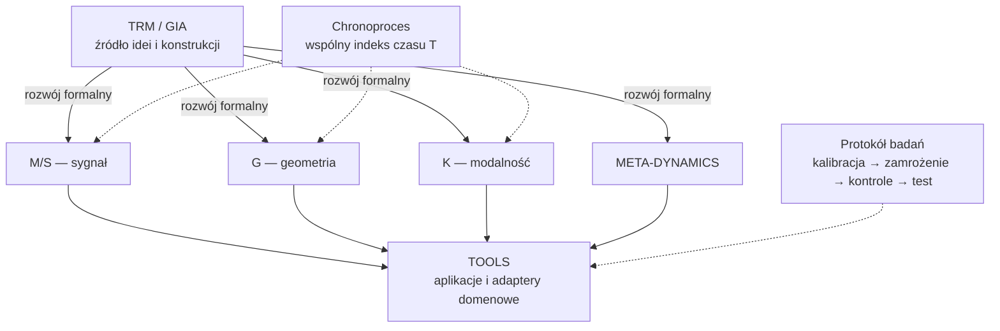

# GIA-TIMDR

GIA-TIMDR to rozwijany przez J. S. Kielicha program badawczo-inżynierski: od pomysłu analizy zmiany przeszedł do czterech sformalizowanych gałęzi, działającego kodu, prerejestrowanych testów i zastosowań na rzeczywistych danych. Obejmuje **M/S** (sygnał), **G** (geometria), **K** (modalność) i **META-DYNAMICS** (agregat Λ–τ–ρ–J). Chronoproces daje trzem pierwszym wspólny nośnik czasu, zachowując odrębność operatorów. Starsza warstwa GIA/TRM pozostaje ważną częścią historii idei projektu.

## Architektura TIMDR

**TIMDR jest frameworkiem konstrukcyjnym rozwijanym z idei TRM/GIA.** Cztery gałęzie dostarczają odrębnych języków matematycznych do opisu sygnału, geometrii, modalności i dynamiki agregatowej. Chronoproces umożliwia wspólny opis czasowy M/S, G i K, a narzędzia domenowe wykorzystują wybrane operatory do konkretnych zadań.

TRM/GIA stanowią źródło idei i konstrukcji całego ekosystemu. Strzałki „rozwój formalny” na diagramie pokazują tę genealogię. [Konstrukcja referencyjna v0.1](docs/theory/TIMDR_EventGraph_Branch_Construction.md) dodaje jawne odwzorowania z grafu zdarzeń do sygnału, krzywej, widma oraz stanu META, wraz z kodem i 17 testami syntetycznymi. Jest pierwszym formalnym krokiem łączącym tę genealogię z reprezentacjami gałęzi; pełne wyprowadzenie wszystkich aksjomatów wymaga dalszej pracy.

W [Chronoprocesie Ξ=(T,x,Γ,φ)](docs/theory/TIMDR_Chronoprocess.md) φ opisuje reprezentację modalną w czasie. Chronoproces koordynuje M/S, G i K; aplikacja korzystająca z jednej gałęzi może używać jej bezpośrednio. Własności operatora GIA, takie jak monotoniczność, stabilność i zbieżność, wymagają określenia mierzonej wielkości oraz warunków ich zachodzenia.

Pełny autorski szkic warstw i zastosowań: [ARCHITEKTURA_TIMDR.md](https://github.com/jbackk-lang/GIA-TIMDR/blob/main/ARCHITEKTURA_TIMDR.md).

Szczegóły nowych odwzorowań: [sygnał — binning, normalizacja i wygładzanie](docs/theory/TIMDR_Signal_From_EventGraph.md) oraz [geometria — krzywa, wstęga i rura](docs/theory/TIMDR_Geometry_From_EventGraph.md). Przykład uruchomisz z katalogu repo poleceniem `python -m core.trm_gia_projections` (Python z NumPy).

## Co już powstało

- Cztery gałęzie opisane definicjami i aksjomatami (13 M/S, 10 G, 10 K, 9 META), cztery formalne repozytoria włączone tutaj z zachowaniem historii oraz kod geometrii, sygnału, fazy i dynamiki.
- Mosty między gałęziami sprawdzone na syntetyce i danych rzeczywistych. MC M/S↔G uzyskał 140/240 kombinacji testowych, w tym Gi 30/30 dla łożysk; B4-Kitchen ma dwa wyniki SUPPORTED w dwóch sesjach jednego uczestnika.
- Samodzielne narzędzia domenowe: m.in. [fusion-tools](https://github.com/jbackk-lang/TIMDR-fusion-tools) (19/19 nowych strzałów TCABR w teście czasu zaniku prądu), synoptyki z pomiarem błędu prognoz, analiza łożysk, monitoring sieci i sejsmika.
- Protokół z prerejestracją, kontrolami, zamrożeniem danych i jawnym zapisem wyników pozytywnych, częściowych oraz negatywnych. Dzięki temu poszczególne twierdzenia można oceniać i replikować, zamiast przyjmować całą koncepcję na wiarę.

To konkretne osiągnięcia w opisanych danych i wersjach. GIA-TIMDR nie przedstawia jeszcze jednej potwierdzonej teorii wszystkich zjawisk; szczegółowy stan i zakres wyników podaje [pełne podsumowanie](PODSUMOWANIE_PROJEKTU_2026-09-23.md).

## Zacznij tutaj

- [Mapa repozytorium](REPOZYTORIUM.md) — gdzie znajduje się kod, dokumentacja, prerejestracje i wyniki.
- [Pełne podsumowanie całego ekosystemu na 23 września 2026 r.](PODSUMOWANIE_PROJEKTU_2026-09-23.md) — osiągnięcia, formalizmy, mosty, zastosowania i granice poszczególnych wyników.
- [Specyfikacja czterech gałęzi](docs/theory/TIMDR_Branch_Specification.md) i [słownik](docs/GLOSSARY_EN_PL.md) — właściwe definicje oraz granice między obiektami.
- [Reguła kalibracji, zamrożenia i testu końcowego](docs/theory/TIMDR_CALIBRATION_FREEZE_RULE.md) — rozwój na train/calibration jest dopuszczony, tuning do wyniku holdoutu nie.
- [Pełny katalog ekosystemu](https://github.com/jbackk-lang/jbackk-lang.github.io/blob/main/KATEGORIE.md) — lista repozytoriów aplikacyjnych i koncepcyjnych; poniżej wymieniono tylko najbliższe temu repo.
- [Historia dawnego README](HISTORIA_README.md) — pełny, zachowany opis koncepcyjny i kronika wcześniejszych prac. Nie jest aktualnym skrótem statusów.

## Formalizmy i kod

| Część | Główne miejsce | Zakres |
|---|---|---|
| M/S | [TIMDR-Math-Formalism](TIMDR-Math-Formalism/) | Operatory sygnałowe i protokół testowania |
| G | [TIMDR-Geometry-Formalism](TIMDR-Geometry-Formalism/) | Krzywizna i dyskretny operator Weingartena |
| K | [TIMDR-Modal-Formalism](TIMDR-Modal-Formalism/) | Częstotliwość, faza, modalność |
| Chronoproces | [TIMDR-Time-Formalism](TIMDR-Time-Formalism/) | Wspólny czas i jawnie ograniczony most Fouriera |
| META-DYNAMICS | [Aksjomaty META-1–META-9](docs/theory/Axioms_META_TIMDR.md), [kod źródłowy](https://github.com/jbackk-lang/TIMDR-META-DYNAMICS) | Wektor stanu Λ–τ–ρ–J i operator ewolucji; implementacje domenowe żyją także w innych repozytoriach |

Cztery katalogi `TIMDR-*-Formalism` zostały włączone przez `git subtree` z zachowaniem historii. Katalog [MAGE-IN-IMAGE-DECODER](MAGE-IN-IMAGE-DECODER/) jest jedynie kopią trzech modułów aplikacyjnych; pełne testy, dane i wyniki tego projektu są w jego własnym repozytorium.

## Jak interpretować wyniki

Test syntetyczny pokazuje, czy implementacja realizuje definicję. Nie dowodzi przydatności na realnych danych. Wynik realnego testu dotyczy konkretnej domeny, danych, wersji operatora i zamrożonych kryteriów. **SUPPORTED**, **NOT SUPPORTED** i **INCONCLUSIVE** są odrębnymi werdyktami; efekt o przeciwnym znaku nie staje się potwierdzeniem po zmianie hipotezy.

Na łożyskach CWRU mosty i metryki topologiczne dały silny sygnał diagnostyczny. Wielokanałowa chronomembrana utrzymała przewidywany kierunek efektu na nowym archiwum obrotów i uszkodzeń, choć ścisłe kryterium przeszło 2 z 3 okien. B4-Kitchen uzyskał dwa wyniki SUPPORTED dla dwóch sesji i przepisów jednego uczestnika. Te wyniki wyznaczają sensowne kierunki replikacji: inne urządzenia, domeny i uczestników. Sejsmika i BTC nie odtworzyły całego wzorca CWRU, a B4-Bearing bez zsynchronizowanej geometrii pozostaje nierozstrzygnięty. Szczegóły i dokładne liczby są w [datowanym podsumowaniu](PODSUMOWANIE_PROJEKTU_2026-09-23.md) oraz parach `PREREG_*` / `RESULT_*` w [docs/geometry](docs/geometry/).

W osobnym projekcie aplikacyjnym [TIMDR-fusion-tools](https://github.com/jbackk-lang/TIMDR-fusion-tools) klasyfikator czasu zaniku prądu `is_fast_quench()` poprawnie rozpoznał 19/19 nowych strzałów tokamaka TCABR. Metryka portretu fazowego `phasespace_funnel_ratio()` osiągnęła na tych samych danych czułość 12/14 i swoistość 5/5. To konkretne wyniki dla TCABR, nie walidacja wszystkich gałęzi TIMDR ani dowód skuteczności na innym tokamaku: próby MAST bez etykiet pozwoliły opisać rozkład sygnału, lecz nie ocenić trafności klasyfikacji. Lej fazowy z fusion-tools był inspiracją dla późniejszych konstrukcji chronogeometrycznych, ale nie jest tym samym operatorem.

## Czym TIMDR jest, a czym nie jest (stan 2026-09-26)

**TIMDR to rama opisu i protokół badania sygnałów dynamicznych, a nie detektor.** Analizę sygnału wykonują ustalone metody
(np. modele AR, kurtoza, widmo, metoda wektora Parka); wkład TIMDR to struktura opisu (gałęzie, Chronoproces),
pre-rejestracja, kontrole i audytowalność wyników. Operatory TIMDR testowane jako cechy diagnostyczne na pięciu
stanowiskach nie dały samodzielnej przewagi nad klasycznymi metodami; jako **uzupełnienie** klasycznych cech drgań topologia TIMDR (winding, crossing, phase winding) przeszła pre-rejestrowany test na łożyskach Paderborn, po wskazaniu na kołach zębatych SEU:

| Stanowisko | Sygnał | TIMDR | Klasyczne metody | Wynik |
|---|---|---|---|---|
| Łożyska CWRU | drgania, kilka kanałów | silny efekt membrany i topologii | nie porównywano z mocnym baseline'em | kierunek powtarzalny, przewaga niezbadana |
| Przekładnia SEU | drgania x/y/z | macro-F1 0,70 / 0,67 przy zmianie warunków pracy | 0,66 / 0,79 (standaryzacja per warunek) | remis; razem 0,95 / 0,81 — mieszane, po fakcie ([wynik](docs/geometry/RESULT_SEU_MULTICHANNEL_DIAGNOSTIC_v0.1.md)) |
| Przekładnia SEU, koła zębate (świeże dane) | drgania x/y/z | razem z klasycznymi 0,57 / 0,60 przy zmianie warunków; 0,86 / 0,80 w obrębie warunku | 0,52 / 0,59; w obrębie warunku 0,70 / 0,66 | MIESZANY: zysk mały przy zmianie warunków, duży w obrębie warunku ([wynik](docs/geometry/RESULT_SEU_GEARSET_CONFIRM_v0.2.md)) |
| **Łożyska Paderborn, drgania** | 1 kanał drgań | razem z klasycznymi 1,00 / 0,86 / 0,99 / 0,97 w obrębie warunku | 0,81 / 0,78 / 0,96 / 0,91 | **SUPPORTED**: zysk +0,09 (95% CI +0,05…+0,13), 4/4 warunki ([wynik](docs/geometry/RESULT_PADERBORN_VIBRATION_COMPLEMENT_v0.1.md)) |
| Budynek LANL (rama 3-kondygnacyjna) | drgania 4 poziomów | AUC 0,45 / 0,53 (losowo) | AUC 0,99 | brak wartości ([wynik](docs/geometry/RESULT_LANL_3STORY_v0.1.md)) |
| Silnik Paderborn | orbita prądów α–β | macro-F1 0,29 (losowo) | 0,74 (wektor Parka) | brak wartości ([wynik](docs/geometry/RESULT_PADERBORN_CURRENT_ORBIT_v0.1.md)) |
| Wideo UCSD Ped2 | ρ per region (META-DYNAMICS) | wykrycie 0,40 przy 0,46 fałszywych alarmów | — | NOT SUPPORTED ([MAGE](https://github.com/jbackk-lang/MAGE-IN-IMAGE-DECODER/blob/main/RESULT_META_DYNAMICS_v0.3.md)) |

Hipoteza, że TIMDR działa tylko przy sygnale wirującym, została sprawdzona bezpośrednio na orbicie prądów silnika
i się nie potwierdziła. Twierdzenia o wykrywaniu lub przewidywaniu przez operatory TIMDR wymagają odtąd nowej
pre-rejestracji z mocnym baseline'em i danymi z więcej niż jedną jednostką na klasę.

## Powiązane zastosowania

To osobne projekty, nie kolejne gałęzie formalne. Ich wyniki, dane i ograniczenia opisują ich własne repozytoria:

| Projekt | Rola i obecna granica |
|---|---|
| [synoptyk-v2.0](https://github.com/jbackk-lang/synoptyk-v2.0) | Korekta prognozy Open-Meteo, filtr falkowy i lokalny bias; nie tworzy własnego modelu pogody |
| [SYNOPTYK-ARCTIC](https://github.com/jbackk-lang/SYNOPTYK-ARCTIC) | Stacje polarne, backtest i pomiar bias/MAE; test proxy „rezonansu” nie miał jeszcze dostatecznej liczby zdarzeń |
| [Synoptyk-v3](https://github.com/jbackk-lang/Synoptyk-v3) | Pogoda jako pole przestrzenne z wektorami wiatru; wstępny pomiar bias/MAE opiera się na krótkim oknie i małej próbie |
| [TIMDR-fusion-tools](https://github.com/jbackk-lang/TIMDR-fusion-tools) | Diagnostyka sygnałów tokamaka; wyniki TCABR opisane wyżej, transfer klasyfikatora na MAST niezweryfikowany etykietami |
| [TIMDR-Industrial-Predict](https://github.com/jbackk-lang/TIMDR-Industrial-Predict) | Sygnały maszyn i demo łożysk CWRU; nie zastępuje pomiaru geometrii wymaganego przez B4-Bearing |
| [TIMDR-Grid-Monitor](https://github.com/jbackk-lang/TIMDR-Grid-Monitor) | Monitoring sygnałów sieci energetycznej i przykłady PROTECT-90 |
| [TIMDR-Earthquake-Core](https://github.com/jbackk-lang/TIMDR-Earthquake-Core) | Analiza sejsmiczna; wyniki pozytywne i negatywne dokumentowane w repo domenowym |
| [MAGE-IN-IMAGE-DECODER](https://github.com/jbackk-lang/MAGE-IN-IMAGE-DECODER) | Obraz i wideo; trzy moduły skopiowano tu pomocniczo, pełny projekt pozostaje osobno |
| [TIMDR-AI-Core](https://github.com/jbackk-lang/TIMDR-AI-Core) | Protokół epistemiczny i eksperymenty aktywacji; linia HARTH zamknięta bez przyrostu nad baseline'em w badanym ustawieniu |

Pełniejszy spis, także projektów koncepcyjnych, jest w [katalogu ekosystemu](https://github.com/jbackk-lang/jbackk-lang.github.io/blob/main/KATEGORIE.md). Tabela nie rości sobie prawa do wyliczenia wszystkich repozytoriów.

Kod i dokumentacja są materiałem badawczym, nie certyfikowanym narzędziem diagnostycznym. Każda deklaracja przewagi wymaga niezależnych danych i porównania z metodami bazowymi.

„GIA używa PCA jako kroku pomocniczego. Sednem operatora jest selekcja rezonansowej trajektorii w grafie zdarzeń TRM/TIMDR.”

## Cytowanie i licencja

Wersjonowane prace autora są dostępne pod DOI: [gałąź sygnałowa](https://doi.org/10.5281/zenodo.22288541), [przegląd ekosystemu](https://doi.org/10.5281/zenodo.22788266), [widmo Laplasjanu na wstędze Möbiusa](https://doi.org/10.5281/zenodo.22812269). Zakres każdego wydania jest różny. Warunki korzystania z kodu określa [LICENSE](LICENSE).
