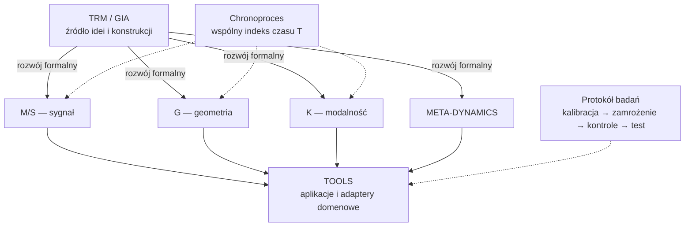

# GIA-TIMDR

GIA-TIMDR to rozwijany przez J. S. Kielicha program badawczo-inżynierski: od pomysłu analizy zmiany przeszedł do czterech sformalizowanych gałęzi, działającego kodu, prerejestrowanych testów i zastosowań na rzeczywistych danych. Obejmuje **M/S** (sygnał), **G** (geometria), **K** (modalność) i **META-DYNAMICS** (agregat Λ–τ–ρ–J). Chronoproces daje trzem pierwszym wspólny nośnik czasu, zachowując odrębność operatorów. Starsza warstwa GIA/TRM pozostaje ważną częścią historii idei projektu.

## Architektura TIMDR

**TIMDR jest frameworkiem konstrukcyjnym rozwijanym z idei TRM/GIA.** Cztery gałęzie dostarczają odrębnych języków matematycznych do opisu sygnału, geometrii, modalności i dynamiki agregatowej. Chronoproces umożliwia wspólny opis czasowy M/S, G i K, a narzędzia domenowe wykorzystują wybrane operatory do konkretnych zadań.

TRM/GIA stanowią źródło idei i konstrukcji całego ekosystemu. Strzałki „rozwój formalny” na diagramie pokazują tę genealogię. [Konstrukcja referencyjna v0.1](docs/theory/TIMDR_EventGraph_Branch_Construction.md) dodaje jawne odwzorowania z grafu zdarzeń do sygnału, krzywej, widma oraz stanu META, wraz z kodem i 17 testami syntetycznymi. Jest pierwszym formalnym krokiem łączącym tę genealogię z reprezentacjami gałęzi; pełne wyprowadzenie wszystkich aksjomatów wymaga dalszej pracy.

```mermaid
flowchart TB
    ROOT["TRM / GIA<br/>źródło idei i konstrukcji"]
    ROOT -->|"rozwój formalny"| MS["M/S — sygnał"]
    ROOT -->|"rozwój formalny"| G["G — geometria"]
    ROOT -->|"rozwój formalny"| K["K — modalność"]
    ROOT -->|"rozwój formalny"| META["META-DYNAMICS"]

    TIME["Chronoproces<br/>wspólny indeks czasu T"]
    TIME -.-> MS
    TIME -.-> G
    TIME -.-> K

    MS --> TOOLS["TOOLS<br/>aplikacje i adaptery domenowe"]
    G --> TOOLS
    K --> TOOLS
    META --> TOOLS

    TEST["Protokół badań<br/>kalibracja → zamrożenie → kontrole → test"]
    TEST -.-> TOOLS
```

W [Chronoprocesie Ξ=(T,x,Γ,φ)](docs/theory/TIMDR_Chronoprocess.md) φ opisuje reprezentację modalną w czasie. Chronoproces koordynuje M/S, G i K; aplikacja korzystająca z jednej gałęzi może używać jej bezpośrednio. Własności operatora GIA, takie jak monotoniczność, stabilność i zbieżność, wymagają określenia mierzonej wielkości oraz warunków ich zachodzenia.

Pełny autorski szkic warstw i zastosowań: [ARCHITEKTURA_TIMDR.md](https://github.com/jbackk-lang/GIA-TIMDR/blob/main/ARCHITEKTURA_TIMDR.md).

Szczegóły nowych odwzorowań: [sygnał — binning, normalizacja i wygładzanie](docs/theory/TIMDR_Signal_From_EventGraph.md) oraz [geometria — krzywa, wstęga i rura](docs/theory/TIMDR_Geometry_From_EventGraph.md). Przykład uruchomisz z katalogu repo poleceniem `python -m core.trm_gia_projections` (Python z NumPy).

## Co już powstało

- Cztery gałęzie opisane definicjami i aksjomatami (13 M/S, 10 G, 10 K, 9 META), cztery formalne repozytoria włączone tutaj z zachowaniem historii oraz kod geometrii, sygnału, fazy i dynamiki.
- Mosty między gałęziami sprawdzone na syntetyce i danych rzeczywistych. MC M/S↔G uzyskał 140/240 kombinacji testowych, w tym Gi 30/30 dla łożysk; B4-Kitchen ma dwa wyniki SUPPORTED w dwóch sesjach jednego uczestnika.
- Samodzielne narzędzia domenowe: m.in. [fusion-tools](https://github.com/jbackk-lang/TIMDR-fusion-tools) (19/19 nowych strzałów TCABR w teście czasu zaniku prądu), synoptyki z pomiarem błędu prognoz, analiza łożysk, monitoring sieci i sejsmika.
- Protokół z prerejestracją, kontrolami, zamrożeniem danych i jawnym zapisem wyników pozytywnych, częściowych oraz negatywnych. Dzięki temu poszczególne twierdzenia można oceniać i replikować, zamiast przyjmować całą koncepcję na wiarę.

To konkretne osiągnięcia w opisanych danych i wersjach. GIA-TIMDR nie przedstawia jeszcze jednej potwierdzonej teorii wszystkich zjawisk; szczegółowy stan i zakres wyników podaje [stan projektu](STAN_PROJEKTU.md).

## Lokalny prototyp SI: negacja i kontrola wyników

TIMDR służy tu jako inspiracja do konstrukcji uczonych składników SI; graf i kalkulator pozostają jego narzędziami kontroli. Rozszerzenie negacji zachowało wcześniejsze umiejętności: **1440/1440 nowych grafów oraz 720/720 regresji** w trzech przebiegach. Na 24 nowych rachunkach Bielik uzyskał **3/24**, układ SI z dokładnym kalkulatorem i walidatorem **24/24**. Wynik rachunków pochodzi z narzędzia, nie z neuronowej arytmetyki.

[Pełny opis, nieudany pierwszy kandydat i ograniczenia](docs/SI_NEGACJA_WALIDACJA_2026-10-02.md). To eksperyment rozwojowy w ograniczonej domenie, nie ogólny ranking SI. Dobór narzędzi i interpretacja całego zadania wymagają dalszych testów. **Publikujemy wyniki i opis bez kodu, wag i pamięci prywatnego SI.**

## Zacznij tutaj

- [Lokalny prototyp AI inspirowany TIMDR — wyniki z 2 października 2026](docs/TIMDR_AI_WYNIKI_2026-10-02.md) — składanie relacji, braki i konflikty oraz uczenie potwierdzonych korekt; opis bez kodu, w ograniczonej domenie syntetycznej.

- [Notatki i spostrzeżenia z 26–27 września 2026](docs/NOTATKI_2026-09-27.md) — idee autora, wyniki i przewidywania zapisane przed testem turbiny.
- [Drogowskazy TIMDR — jak zbudować program analizujący sygnał](docs/DROGOWSKAZY_TIMDR.md) — kroki pole → rezonans → sito → samokorekta → geometria → test, z przykładem sita rezonansowego dla łożysk.
- [Mapa repozytorium](REPOZYTORIUM.md) — gdzie znajduje się kod, dokumentacja, prerejestracje i wyniki.
- [Stan projektu](STAN_PROJEKTU.md) — czym TIMDR jest dziś, zasady potwierdzone testami, najmocniejsze wyniki, zastosowania i bilans wszystkich testów (odświeżany jednym poleceniem). Poprzednie podsumowanie: [archiwum, 23.09.2026](docs/archiwum/PODSUMOWANIE_PROJEKTU_2026-09-23.md).
- [Specyfikacja czterech gałęzi](docs/theory/TIMDR_Branch_Specification.md) i [słownik](docs/GLOSSARY_EN_PL.md) — właściwe definicje oraz granice między obiektami.
- [Reguła kalibracji, zamrożenia i testu końcowego](docs/theory/TIMDR_CALIBRATION_FREEZE_RULE.md) — rozwój na train/calibration jest dopuszczony, tuning do wyniku holdoutu nie.
- [Pełny katalog ekosystemu](https://github.com/jbackk-lang/jbackk-lang.github.io/blob/main/KATEGORIE.md) — lista repozytoriów aplikacyjnych i koncepcyjnych; poniżej wymieniono tylko najbliższe temu repo.
- [Historia dawnego README](HISTORIA_README.md) — pełny, zachowany opis koncepcyjny i kronika wcześniejszych prac. Nie jest aktualnym skrótem statusów.

## Formalizmy i kod

| Część | Główne miejsce | Zakres |
|---|---|---|
| M/S | [TIMDR-Math-Formalism](TIMDR-Math-Formalism/) | Operatory sygnałowe i protokół testowania |
| G | [TIMDR-Geometry-Formalism](TIMDR-Geometry-Formalism/) | Krzywizna i dyskretny operator Weingartena |
| K | [TIMDR-Modal-Formalism](TIMDR-Modal-Formalism/) | Częstotliwość, faza, modalność |
| Chronoproces | [TIMDR-Time-Formalism](TIMDR-Time-Formalism/) | Wspólny czas i jawnie ograniczony most Fouriera |
| META-DYNAMICS | [Aksjomaty META-1–META-9](docs/theory/Axioms_META_TIMDR.md), [kod źródłowy](https://github.com/jbackk-lang/TIMDR-META-DYNAMICS) | Wektor stanu Λ–τ–ρ–J i operator ewolucji; implementacje domenowe żyją także w innych repozytoriach |

Cztery katalogi `TIMDR-*-Formalism` zostały włączone przez `git subtree` z zachowaniem historii. Katalog [MAGE-IN-IMAGE-DECODER](MAGE-IN-IMAGE-DECODER/) jest jedynie kopią trzech modułów aplikacyjnych; pełne testy, dane i wyniki tego projektu są w jego własnym repozytorium.

## Jak interpretować wyniki

Test syntetyczny pokazuje, czy implementacja realizuje definicję. Nie dowodzi przydatności na realnych danych. Wynik realnego testu dotyczy konkretnej domeny, danych, wersji operatora i zamrożonych kryteriów. **SUPPORTED**, **NOT SUPPORTED** i **INCONCLUSIVE** są odrębnymi werdyktami; efekt o przeciwnym znaku nie staje się potwierdzeniem po zmianie hipotezy.

Na łożyskach CWRU mosty i metryki topologiczne dały silny sygnał diagnostyczny. Wielokanałowa chronomembrana utrzymała przewidywany kierunek efektu na nowym archiwum obrotów i uszkodzeń, choć ścisłe kryterium przeszło 2 z 3 okien. B4-Kitchen uzyskał dwa wyniki SUPPORTED dla dwóch sesji i przepisów jednego uczestnika. Te wyniki wyznaczają sensowne kierunki replikacji: inne urządzenia, domeny i uczestników. Sejsmika i BTC nie odtworzyły całego wzorca CWRU, a B4-Bearing bez zsynchronizowanej geometrii pozostaje nierozstrzygnięty. Szczegóły i dokładne liczby są w [stanie projektu](STAN_PROJEKTU.md) oraz parach `PREREG_*` / `RESULT_*` w [docs/geometry](docs/geometry/).

W osobnym projekcie aplikacyjnym [TIMDR-fusion-tools](https://github.com/jbackk-lang/TIMDR-fusion-tools) klasyfikator czasu zaniku prądu `is_fast_quench()` poprawnie rozpoznał 19/19 nowych strzałów tokamaka TCABR. Metryka portretu fazowego `phasespace_funnel_ratio()` osiągnęła na tych samych danych czułość 12/14 i swoistość 5/5. To konkretne wyniki dla TCABR, nie walidacja wszystkich gałęzi TIMDR ani dowód skuteczności na innym tokamaku: próby MAST bez etykiet pozwoliły opisać rozkład sygnału, lecz nie ocenić trafności klasyfikacji. Lej fazowy z fusion-tools był inspiracją dla późniejszych konstrukcji chronogeometrycznych, ale nie jest tym samym operatorem.

## Czym TIMDR jest, a czym nie jest (stan 2026-09-26)

**TIMDR to model do budowania programów analizujących sygnały: rama opisu, drogowskazy konstrukcji (pole, rezonans, sito, samokorekta) i protokół badania — a nie gotowy detektor.** Analizę sygnału wykonują ustalone metody
(np. modele AR, kurtoza, widmo, metoda wektora Parka); wkład TIMDR to struktura opisu (gałęzie, Chronoproces),
pre-rejestracja, kontrole i audytowalność wyników. Operatory TIMDR testowane jako cechy diagnostyczne na pięciu
stanowiskach nie dały samodzielnej przewagi nad klasycznymi metodami; jako **uzupełnienie** klasycznych cech drgań topologia TIMDR (winding, crossing, phase winding) przeszła pre-rejestrowany test na łożyskach Paderborn ze sztucznym uszkodzeniem, ale nie przeniosła się na uszkodzenia naturalne i łożyska spoza uczenia. Na tych samych, najtrudniejszych danych przeszła natomiast konstrukcja z idei „membrana = pole, rezonans ustala oczka sita” — lepsza od klasycznych cech i od zwykłej obwiedni (mechanizm pokrewny analizie cyklostacjonarnej):

| Stanowisko | Sygnał | TIMDR | Klasyczne metody | Wynik |
|---|---|---|---|---|
| Łożyska CWRU | drgania, kilka kanałów | silny efekt membrany i topologii | nie porównywano z mocnym baseline'em | kierunek powtarzalny, przewaga niezbadana |
| Przekładnia SEU | drgania x/y/z | macro-F1 0,70 / 0,67 przy zmianie warunków pracy | 0,66 / 0,79 (standaryzacja per warunek) | remis; razem 0,95 / 0,81 — mieszane, po fakcie ([wynik](docs/geometry/RESULT_SEU_MULTICHANNEL_DIAGNOSTIC_v0.1.md)) |
| Przekładnia SEU, koła zębate (świeże dane) | drgania x/y/z | razem z klasycznymi 0,57 / 0,60 przy zmianie warunków; 0,86 / 0,80 w obrębie warunku | 0,52 / 0,59; w obrębie warunku 0,70 / 0,66 | MIESZANY: zysk mały przy zmianie warunków, duży w obrębie warunku ([wynik](docs/geometry/RESULT_SEU_GEARSET_CONFIRM_v0.2.md)) |
| **Łożyska Paderborn, drgania** | 1 kanał drgań | razem z klasycznymi 1,00 / 0,86 / 0,99 / 0,97 w obrębie warunku | 0,81 / 0,78 / 0,96 / 0,91 | **SUPPORTED**: zysk +0,09 (95% CI +0,05…+0,13), 4/4 warunki ([wynik](docs/geometry/RESULT_PADERBORN_VIBRATION_COMPLEMENT_v0.1.md)) |
| Łożyska CWRU, test na niewidzianych łożyskach | drgania DE, baseline z widmem obwiedni | razem 0,98 / 0,98 / 1,00 / 1,00; sam TIMDR 0,29–0,56 | 1,00 / 0,92 / 0,94 / 1,00 | MIESZANY: zysk tylko tam, gdzie baseline poniżej sufitu ([wynik](docs/geometry/RESULT_CWRU_CROSS_BEARING_ENVELOPE_v0.1.md)) |
| **Łożyska Paderborn, uszkodzenia naturalne, niewidziane łożyska (15 łożysk)** | drgania + 2 prądy | topologia: zysk +0,01; sito z nałożenia pól 0,37 (samo pole drgań 0,54) | 0,58 (z widmem obwiedni) | A MIESZANY (brak efektu), pole/rezonans/sito NOT SUPPORTED ([wynik](docs/geometry/RESULT_PADERBORN_REAL_DAMAGE_v0.1.md)) |
| **Łożyska Paderborn, uszkodzenia naturalne — sito samokorygujące** | drgania: pole pasm nośnych, rezonans ustala oczka sita | **0,68** (niewidziane łożyska i pomiary) | 0,56 klasyczne, 0,61 sama obwiednia | **SUPPORTED** (H1 +0,12, 4/5; H2 +0,075, 3/5) ([wynik](docs/geometry/RESULT_PADERBORN_RESONANCE_SIEVE_v0.1.md)) |
| Łożyska Paderborn — replikacja sita (pomiary 11–15) + kurtogram | drgania | **0,65** | 0,56 klasyczne, 0,61 obwiednia, 0,55 kurtogram | replikacja częściowa: vs klasyczne SUPPORTED, vs kurtogram SUPPORTED, vs obwiednia MIESZANY ([wynik](docs/geometry/RESULT_PADERBORN_RESONANCE_SIEVE_REPLICATION_v0.2.md)) |
| Łożyska Paderborn — trzecie potwierdzenie (pomiary 16–20) + łącznie 15 foldów | drgania | **0,65** | 0,62 klasyczne, 0,64 obwiednia, 0,49 kurtogram | łącznie: vs klasyczne **SUPPORTED** (+0,08, 12/15), vs obwiednia MIESZANY (+0,04, 10/15), vs kurtogram SUPPORTED ([wynik](docs/geometry/RESULT_PADERBORN_RESONANCE_SIEVE_CONFIRM_v0.3.md)) |
| **Turbina wiatrowa Fraunhofer LBF (w terenie, zmienna prędkość)** | drgania łożyska, zegar z tachometru | sito w osi kątowej: AUC **1,00** (bieżnia zewnętrzna), swoistość 1,00 | sito przy stałej prędkości 0,85; kurtoza/RMS rozpoznają dzień, nie usterkę | **SUPPORTED** (H1, H2); bieżnia wewnętrzna i element toczny niewykryte; śledzenie prędkości z drgań odpadło ([wynik](docs/geometry/RESULT_WIND_LBF_ORDER_SIEVE_v0.1.md)) |
| **Radar 77 GHz, Open Radar (mikro-Doppler: człowiek/rower/dron/pojazd)** | widma Dopplera, ślady spoza uczenia (późniejsze sesje) | sito w polu klatki × pasma: AUC dron 0,76, F1 0,40 | klasyczne (entropia, cepstrum JEM, CVD) AUC 0,90, F1 0,52; dodanie sita nie pomaga | **NOT SUPPORTED** (H1); sito samo działa (H2), ale słabiej; kinematyka 0,96 = ślad akwizycji ([wynik](docs/geometry/RESULT_OPEN_RADAR_MICRODOPPLER_v0.1.md)) |
| Radar Open Radar — jako rura (zwinięte pole, I/Q w czasie wolnym) | te same ślady eval (ujawnione) | rura AUC 0,76; pole + rura (sam TIMDR) 0,85 | klasyczne 0,90 | **NOT SUPPORTED** (H1); sam TIMDR MIXED (−0,05, CI do +0,01); „dron = cząsteczki” odwrotnie — szybka rura drona to szum ([wynik](docs/geometry/RESULT_OPEN_RADAR_TUBE_v0.2.md)) |
| Radar Open Radar — lustro i cień (połówki ±d wokół linii ciała, stereoskopia; całe ślady) | te same ślady eval, 3. użycie (ujawnione) | lustro M: AUC osoba 0,77, rower 0,77; A+C+M F1 0,50 | klasyka v0.1 F1 0,52, rower 0,76; A+C F1 0,55 | **NOT SUPPORTED** (H1 −0,05); rower MIXED (+0,01, vs CVD całego śladu +0,28); stereoskopia z dev nie powtórzyła się (osoby w eval 2,5× krótsze — rytm kroku w 24% śladów); dron: przewidziana porażka 0,47 ([wynik](docs/geometry/RESULT_OPEN_RADAR_MIRROR_v0.3.md)) |
| Radar mmWave 77 GHz (surowe I/Q, chód 16 s) — lustro i cień na danych spełniających regułę wykonalności | nagrania 12–20 (po 9: ukryta butelka / utykanie / machanie) | lustro M macro-F1 0,89; C+M 0,93 | klasyka (CVD) 0,81 | **H3 SUPPORTED 3/3** (cień i przeciwfaza przy nieruchomej ręce, rozprzężenie przy machaniu), H4 SUPPORTED, H1 MIXED (+0,11, CI od 0), H2 sufit ([wynik](docs/geometry/RESULT_MMWAVE_MIRROR_v0.4.md)) |
| Paderborn — TIMDR jako warstwa porządkująca przed siecią z uwagą (krzywe uczenia, łożyska rozłączne) | 5 foldów × 3 losowania, N = 4…160 na klasę | sieć na polu TIMDR 0,63 już przy N = 4; cechy sita + LDA 0,74 | ta sama sieć na spektrogramie 0,41–0,45, na surowym przebiegu 0,31–0,44 | **H1–H3 SUPPORTED** — 8× mniej przykładów niż spektrogram, 40× niż surowy; sieć nic nie dodaje ponad strukturę TIMDR ([wynik](docs/geometry/RESULT_PADERBORN_LEARNING_CURVES_v0.1.md)) |
| MUZ P1 — budżet: zegar od wypłaty + odniesienie do własnego dochodu (PKDD'99, kredyty; prognoza z historii przed kredytem) | 316 kredytów testowych, 32 złe (podział po rachunkach) | AUC 0,87 (T); T+klasyka 0,92 | klasyka kalendarzowa nominalna 0,94 | **NOT SUPPORTED** (H1 −0,06, CI < 0; zegar H2 −0,01; odniesienie H3 −0,04) — odniesienie wycięło sygnał: przy wypłacalności poziom kwot jest celem, nie zakłóceniem ([wynik](docs/geometry/RESULT_MUZ_P1_BERKA_v0.1.md)) |
| MUZ P2 — budżet: wzorzec = rata (to, o co pyta decyzja), dołek salda przed wypłatą | te same 316 kredytów, 2. użycie (ujawnione) | względem raty 0,91 (dochód w P1: 0,87); C+R 0,93 | klasyka 0,935 | H1 NOT SUPPORTED (C+R −0,001), H2 MIXED (+0,04 rata vs dochód), H3 zegar od wypłaty NOT (−0,03), H4 remis — wzorzec poprawiony, przewagi brak, sufit ≈ 0,94 ([wynik](docs/geometry/RESULT_MUZ_P2_BERKA_v0.1.md)) |
| MUZ-SIM — zarządca budżetu w zamkniętej pętli: wyprowadzenie zadłużonego gospodarstwa „na prostą” (symulacja 36 mies.: przesuwane wypłaty, inflacja per kategoria, rozliczenia, awarie, przerwy w pracy) | 400 gospodarstw × 3 scenariusze, wspólne liczby losowe | MUZ 60,8% | aplikacja bankowa 0,3%; koperty (styl YNAB) 55,5%; granica (zna przyszłość) 78,7% | **H1 SUPPORTED** (+5,2 pkt vs koperty), zegar +3,7 i odniesienie +4,3 SUPPORTED, reżim zdarzeń MIXED; kontrola S0 i przewidziana porażka S2 zgodne; symulacja własna — mechanizm, nie realia ([wynik](docs/geometry/RESULT_MUZ_SIM_v0.1.md)) |
| Budynek LANL (rama 3-kondygnacyjna) | drgania 4 poziomów | AUC 0,45 / 0,53 (losowo) | AUC 0,99 | brak wartości ([wynik](docs/geometry/RESULT_LANL_3STORY_v0.1.md)) |
| Budynek LANL — jako pole (kanały × pasma) + sito cząsteczkowości | te same dane co v0.1 (ujawnione) | AUC 0,83 / 0,85; fałszywe alarmy 0,025 | klasyczne SHM 0,99; alarmy 0,063 | **NOT SUPPORTED** (H1–H3); wykrywa rzadkie uderzenia (szczelina 0,15–0,13 mm), gubi częste — obserwacja: częste uderzenia zlewają się w falę ([wynik](docs/geometry/RESULT_LANL_FIELD_SIEVE_v0.2.md)) |
| Budynek LANL — kotwica modalna K → linie w reżimie fali | te same dane (trzecie użycie, ujawnione) | ciężkość ρ **+0,98**, AUC 0,96 | klasyczne SHM ρ 0,97, AUC 0,99 | **SUPPORTED** (H1 odwrócenie ciężkości z −0,57; H2); D względem ciężkości NOT SUPPORTED ([wynik](docs/geometry/RESULT_LANL_MODAL_ANCHOR_v0.3.md)) |
| **Łożyska PRONOSTIA do zniszczenia (11 nieoglądanych)** | drgania, całe życie łożyska | D spada w 9/11 (pole → cząsteczka), powrót na końcu 7/11 (fala) | kurtoza — remis; RMS: silniejszy, ale niespójny kierunek | **SUPPORTED** (H1–H4); reguła wykonalności trafnie przewidziała słabe sito przy oknie 0,1 s ([wynik](docs/geometry/RESULT_PRONOSTIA_REGIME_PATH_v0_1.md)) |
| Most Hell Bridge Test Arena (stalowa kratownica, 8 stanów uszkodzeń) | drgania 59 kanałów, szum z wibratora | kotwica K + kształt modu: AUC 0,65 | AR(5): 0,79 | **NOT SUPPORTED** (H1, H2); ranking uszkodzeń zgodny z publikacją (H3); stężeń nie widzi ([wynik](docs/geometry/RESULT_HBTA_MODAL_ANCHOR_v0.1.md)) |
| Most HBTA — most K↔G: kształt modu z fazą + krzywizna | 40 czujników siatki podłużnic, faza względem wibratora | kształt z fazą 0,78; krzywizna 0,72 (v0.1 bez fazy: 0,65) | AR(5): 0,80 | **NOT SUPPORTED** (H1, H2); faza domyka lukę do AR, krzywizna nie dodaje; pionowe > stężenia (H3) ([wynik](docs/geometry/RESULT_HBTA_MODAL_CURVATURE_v0.2.md)) |
| Most HBTA — lokalne uszkodzenie = przerwanie ciągłości (K → G → M/S) | kształt z fazą, skok wzdłuż i w poprzek podłużnic | uszkodzenia pionowe 0,93–0,94 (każde ≥ AR); średnio 0,80 | AR(5): 0,80 | H1 NOT SUPPORTED (remis), **H2 SUPPORTED**; stężenia niewidoczne dla czujników pionowych ([wynik](docs/geometry/RESULT_HBTA_DISCONTINUITY_v0.3.md)) |
| Hell Bridge — antyrezonanse (zera FRF, gałąź K od strony zer) na nowych danych sweep | rozwój P2, test P1 (inna pozycja wibratora), null UDS_02 vs UDS_01 | zera > null 0/8 (rozwój 7/8) | bieguny > null 6/8 | **NOT SUPPORTED** (H1–H3); zera lokalne także na temperaturę i pozycję wzbudzenia — nie przenoszą się między pozycjami ([wynik](docs/geometry/RESULT_HBTA_ANTIRESONANCE_v0.4.md)) |
| Hell Bridge — kierunek (sweep poprzeczny, czujniki AG y) + stosunki częstotliwości (odniesienie z samej stali) | rozwój P2, test P1; Y nowe, Z 2. użycie | Z po normalizacji: bieguny > null 8/8 (stężenia 4,4–4,7×), zera 7/8 (surowe 0/8) | surowe bieguny Z 5/8 | **H2 SUPPORTED** (null mniejszy 4/4, wbrew przewidywaniu z rozwoju); H1 kierunek MIXED; H1b SUPPORTED — stosunki działają, gdy zmiana między dniami jest równym skalowaniem ([wynik](docs/geometry/RESULT_HBTA_LATERAL_RATIOS_v0.5.md)) |
| KW51 — stosunki częstotliwości jako odniesienie z samej stali (bez termometru), 15 miesięcy co godzinę | rozwój XII–II, test III–V 2019 i po wzmocnieniu (nieoglądane) | rozrzut −26% (mediana), \|ρ z T\| 0,48 → 0,16; lepiej niż termometr w 5/6 modów | regresja na temperaturze \|ρ\| 0,29 | **H1 SUPPORTED, H1b SUPPORTED**; wykrycie wzmocnienia sufit (wszystkie 100%, 0 fałszywych) — MIXED ([wynik](docs/geometry/RESULT_KW51_RATIOS_v0.2.md)) |
| LUMO (wieża kratowa, CC-BY) — stosunki w porach roku (−4…40 °C) + usunięte stężenia (poziom i pojedynczy pręt) | baza X 2020, test XI 2020–VI 2021 | stosunki AUC 0,96, fałszywe alarmy 20% | surowe AUC 0,99 (alarmy 52%); termometr 0,88 (alarmy 88%) | **NOT SUPPORTED** (H1, H2) — przewidziane: mody idą z temperaturą w różne strony, więc nie ma równego skalowania ([wynik](docs/geometry/RESULT_LUMO_RATIOS_v0.1.md)) |
| Most kolejowy KW51 (Leuven), przed i po wzmocnieniu | drgania otoczenia, 2 kanały pionowe | kotwica K: AUC **1,00**, zgodność z OMA ≤ 1% (4/5 modów) | AR 0,67; SSI autorów 1,00 (remis, sufit) | **SUPPORTED** (H1–H4); widzi zmianę globalnej sztywności ([wynik](docs/geometry/RESULT_KW51_MODAL_ANCHOR_v0.1.md)) |
| Połączenie śrubowe ORION-AE (luzowanie 60 → 5 cNm) | wibrometr + emisja akustyczna 5 MHz, inne kampanie niż rozwój | linie K przy kotwicy: ρ −0,85 / −0,64; cząsteczkowość emisji max przy średnim luzie (obie serie) | klasyka: klasyfikacja poziomu 0,04 (TIMDR 0,18 — obie przy poziomie losowym) | **SUPPORTED** (H1, H3; H2 formalnie) ([wynik](docs/geometry/RESULT_ORION_BOLT_v0.1.md)) |
| Silnik Paderborn | orbita prądów α–β | macro-F1 0,29 (losowo) | 0,74 (wektor Parka) | brak wartości ([wynik](docs/geometry/RESULT_PADERBORN_CURRENT_ORBIT_v0.1.md)) |
| Wideo UCSD Ped2 | ρ per region (META-DYNAMICS) | wykrycie 0,40 przy 0,46 fałszywych alarmów | — | NOT SUPPORTED ([MAGE](https://github.com/jbackk-lang/MAGE-IN-IMAGE-DECODER/blob/main/RESULT_META_DYNAMICS_v0.3.md)) |

Hipoteza, że TIMDR działa tylko przy sygnale wirującym, została sprawdzona bezpośrednio na orbicie prądów silnika
i się nie potwierdziła. Twierdzenia o wykrywaniu lub przewidywaniu przez operatory TIMDR wymagają odtąd nowej
pre-rejestracji z mocnym baseline'em i danymi z więcej niż jedną jednostką na klasę.

## Astronomia i obserwacje — nowe aplikacje

[Podsumowanie wyników, zakres i kod](docs/astronomy/ASTRONOMIA_2026-09-30.md) · [snapshoty źródeł](applications/astronomy/README.md).

**TIMDR-orbital-tracker**: katalogowe orbity SGP4, pomiary i prototyp śledzenia. **TIMDR-lightcurve-fewshot**: mało etykiet, diagnostyka krzywych oraz zdjęcia FITS → fotometria → analiza. To konstrukcje aplikacyjne TIMDR, nie nowe prawa orbitalne. Pilot ATLAS: TIMDR 84,82%, bez sita 85,78%, klasyczne + RF 91,35% macro-F1; obecna adaptacja nie wykazała przewagi. Fotometria sprawdzona na symulacji; walidacja na rzeczywistych zdjęciach pozostaje otwarta.

## Powiązane zastosowania

To projekty zbudowane według zasady TIMDR: z małego rdzenia wyprowadzić mechanizm interpretacji, działania i samokorekty. Nie są kolejnymi gałęziami formalnymi. Ich wyniki, dane i ograniczenia opisują ich własne repozytoria:

| Projekt | Rola i obecna granica |
|---|---|
| [TIMDR-orbital-tracker](https://github.com/jbackk-lang/TIMDR-orbital-tracker) | Astronomia / śledzenie: SGP4 i kojarzenie pomiarów, publiczne elementy orbitalne; niezależne rzeczywiste pomiary pozycji jeszcze niezwalidowane |
| [TIMDR-lightcurve-fewshot](https://github.com/jbackk-lang/TIMDR-lightcurve-fewshot) | Astronomia / fotometria i klasyfikacja: OGLE, pilot ATLAS, interfejs zdjęć; brak przewagi obecnego sita, zdjęcia zwalidowane tylko syntetycznie |
| [synoptyk-v2.0](https://github.com/jbackk-lang/synoptyk-v2.0) | Korekta prognozy Open-Meteo, filtr falkowy i lokalny bias; nie tworzy własnego modelu pogody |
| [SYNOPTYK-ARCTIC](https://github.com/jbackk-lang/SYNOPTYK-ARCTIC) | Stacje polarne, backtest i pomiar bias/MAE; test proxy „rezonansu” nie miał jeszcze dostatecznej liczby zdarzeń |
| [Synoptyk-v3](https://github.com/jbackk-lang/Synoptyk-v3) | Pogoda jako pole przestrzenne z wektorami wiatru; wstępny pomiar bias/MAE opiera się na krótkim oknie i małej próbie |
| [TIMDR-fusion-tools](https://github.com/jbackk-lang/TIMDR-fusion-tools) | Diagnostyka sygnałów tokamaka; wyniki TCABR opisane wyżej, transfer klasyfikatora na MAST niezweryfikowany etykietami |
| [TIMDR-Industrial-Predict](https://github.com/jbackk-lang/TIMDR-Industrial-Predict) | Sygnały maszyn i demo łożysk CWRU; nie zastępuje pomiaru geometrii wymaganego przez B4-Bearing |
| [TIMDR-Grid-Monitor](https://github.com/jbackk-lang/TIMDR-Grid-Monitor) | Monitoring sygnałów sieci energetycznej i przykłady PROTECT-90 |
| [TIMDR-Earthquake-Core](https://github.com/jbackk-lang/TIMDR-Earthquake-Core) | Analiza sejsmiczna; wyniki pozytywne i negatywne dokumentowane w repo domenowym |
| [MAGE-IN-IMAGE-DECODER](https://github.com/jbackk-lang/MAGE-IN-IMAGE-DECODER) | Obraz i wideo; trzy moduły skopiowano tu pomocniczo, pełny projekt pozostaje osobno |
| [TIMDR-AI-Core](https://github.com/jbackk-lang/TIMDR-AI-Core) | Protokół epistemiczny i eksperymenty aktywacji; linia HARTH zamknięta bez przyrostu nad baseline'em w badanym ustawieniu |
| [AI-SI](https://github.com/jbackk-lang/AI-SI) | Najdalsze rozwinięcie zasady TIMDR: system łączący język, pamięć, matematykę i programowanie, który sprawdza własne wyniki i wykorzystuje zdobyte doświadczenia. Uczony koordynator wybiera przebiegi współpracy modeli i narzędzi, a odpowiedzi przechodzą kontrolę (walidator, testy kodu, odrzucanie nieprzechodzących kandydatów). Publiczne repo: interfejs, narzędzia, wyniki; bez prywatnego rdzenia i wag |
| [TIMeDR-MUZ](https://github.com/jbackk-lang/TIMeDR-MUZ) | Warstwa wykonawcza: przekłada zweryfikowaną decyzję na konkretny plan działania, wymaga zatwierdzenia i zapisuje przebieg. W podziale ról TIMDR dostarcza zasady, AI-SI interpretuje i weryfikuje, MUZ realizuje zatwierdzony plan. Prototyp: pomaga zarządzać budżetem i przygotowuje pisma; nic nie przenosi pieniędzy |
| [RADAR-TRACKING](https://github.com/jbackk-lang/RADAR-TRACKING) | Mały rdzeń śledzenia z oceną zmiany ruchu i porównaniem trzech wariantów; tylko symulacja, TIMDR nie jest zawsze najlepszy |
| [TIMDR-Radar-Module](https://github.com/jbackk-lang/TIMDR-Radar-Module) | Rdzeń analizy trajektorii (twisty, redukcja szumu) i dokładny przekrój radarowy kuli (Mie); wynik pola częstotliwości umiarkowany (−7,6% błędu), dla dronów gorszy |
| [TIMDR-Structural-Health](https://github.com/jbackk-lang/TIMDR-Structural-Health) | Rdzeń monitorowania konstrukcji (kotwica modalna, detektor nowości); testy wzorcowe, bez walidacji na rzeczywistej konstrukcji |

Pełniejszy spis, także projektów koncepcyjnych, jest w [katalogu ekosystemu](https://github.com/jbackk-lang/jbackk-lang.github.io/blob/main/KATEGORIE.md). Tabela nie rości sobie prawa do wyliczenia wszystkich repozytoriów.

Kod i dokumentacja są materiałem badawczym, nie certyfikowanym narzędziem diagnostycznym. Każda deklaracja przewagi wymaga niezależnych danych i porównania z metodami bazowymi.

„GIA używa PCA jako kroku pomocniczego. Sednem operatora jest selekcja rezonansowej trajektorii w grafie zdarzeń TRM/TIMDR.”

## Cytowanie i licencja

Wersjonowane prace autora są dostępne pod DOI: [gałąź sygnałowa](https://doi.org/10.5281/zenodo.22288541), [przegląd ekosystemu](https://doi.org/10.5281/zenodo.22788266), [widmo Laplasjanu na wstędze Möbiusa](https://doi.org/10.5281/zenodo.22812269). Zakres każdego wydania jest różny. Warunki korzystania z kodu określa [LICENSE](LICENSE).
